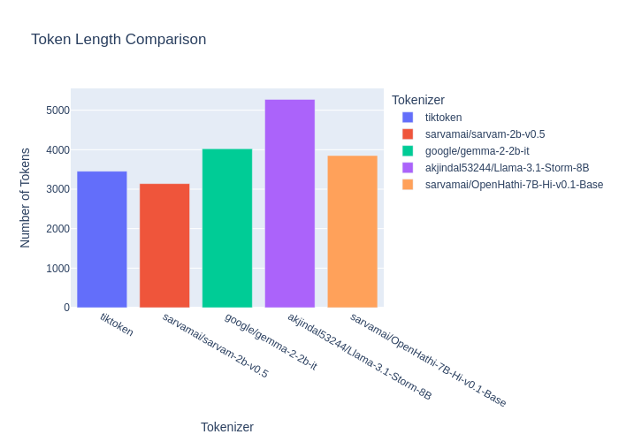
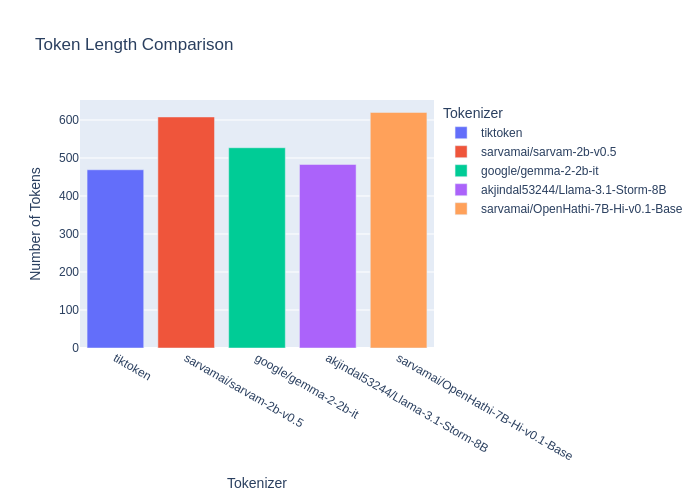
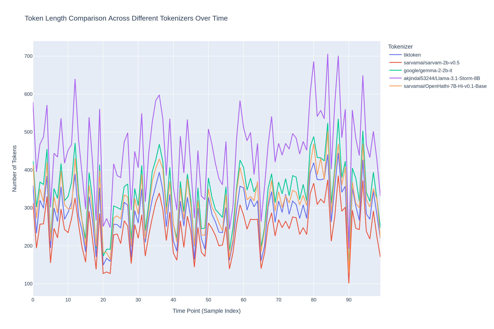
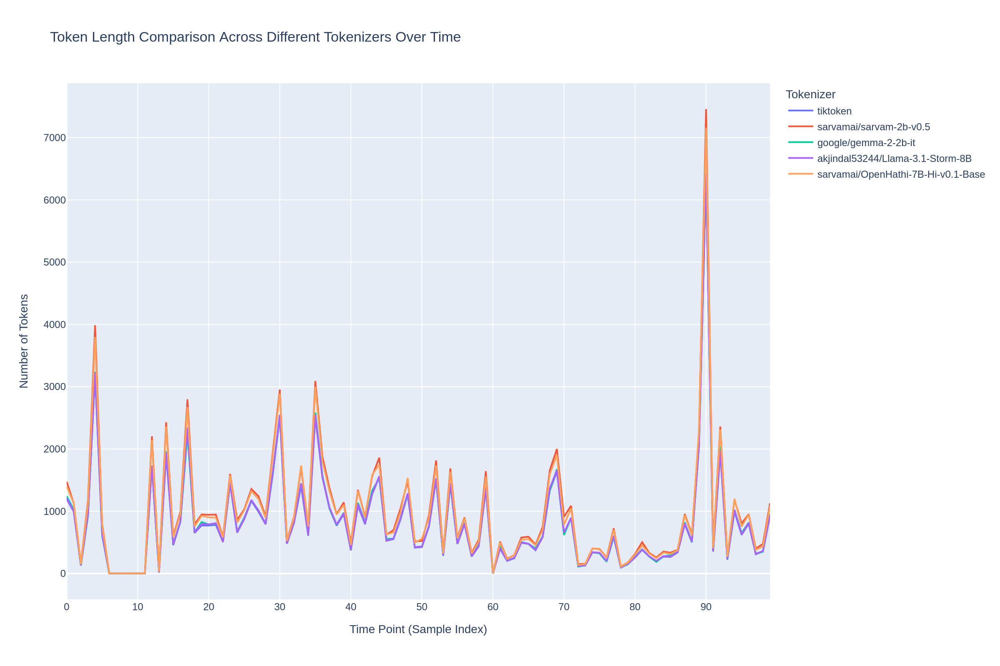

# Tokenizer-Viz 

Simply , Tokenizing is the process where we take a corpus of texts and then convert them into numbers, There are many ways to optimize our codes when training Language models , Tokenizing is one of them.

For example, consider a tokenizer trained predominantly on English texts. Such a tokenizer is typically optimized to handle English text efficiently. It can tokenize English sentences into fewer tokens or numbers compared to a more generic tokenizer. This efficiency arises because the tokenizer is specifically tuned to the language’s vocabulary and structure, thereby minimizing the number of tokens required to represent the text.

To illustrate this, we compared several tokenizers by analyzing their performance on a sample text. The tokenizers evaluated are:

- `gpt-4o` from Tiktoken
- `sarvam-2b` from Hugging Face
- `gemma-2-2b` from Hugging Face
- `llama-3.1-storm` from Hugging Face
- `openhathi` from Hugging Face

`PS: The sample text is just a subset of what we evaluated them on,the true text is just too long`
```bash 
भूतविद्या क्या है? अध्यात्मवाद की बात करें तो ज्यादातर लोगयह भावना कॉल, दिवंगत रिश्तेदारों और प्रसिद्ध लोगों के साथ संचार प्रस्तुत करता है जिन्हें रहस्यमय फिल्मों में देखा गया है। इस लेख में हम यह जानने की कोशिश करेंगे कि वास्तव में आध्यात्मिकता क्या है, इसकी उत्पत्ति कहां और कब हुई, भविष्य में इसका विकास कैसे हुआ। "अध्यात्मवाद" शब्द लैटिन स्पिरिटस से बना था, जिसका अर्थ है "आत्मा, आत्मा," और इसका अर्थ है धार्मिक और दार्शनिक सिद्धांत। एक शिक्षण के रूप में आध्यात्मिकताः यह क्या है? अध्यात्मवाद की रहस्यमय शिक्षाओं का सार हो सकता हैइस धारणा के रूप में सूत्रबद्ध करें कि किसी व्यक्ति का आध्यात्मिक अंग शरीर की शारीरिक मृत्यु के बाद भी अपना अस्तित्व बनाए रखता है। इसके अलावा, यह एक नियम के रूप में, एक मध्यस्थ के माध्यम से रहने वाले के साथ संवाद करने में सक्षम है। इस सिद्धांत के अनुयायियों का दावा है कि आत्माएं प्राकृतिक घटनाओं और संपूर्ण भौतिक सार को नियंत्रित करती हैं। बुरी आत्माओं की सहायता से किए जाने वाले जादू के टोटकों को जादू टोना कहा जाता है। बाइबल और, तदनुसार, चर्च स्पष्ट रूप से आध्यात्मिकता के सभी रूपों की निंदा करता है। 

```


```bash
There is so much to think about when packing for a trip to Indonesia. More so for an extended trip. Surfers might not carry as much stuff as a kiteboarder, but a surfer planning on a more extended surf trip is going to need to pack carefully. There is a golden rule when packing for a surf trip or any trip whatsoever – 'half the clothing and twice the money.'Outerknown boardshort made from 100% Australian Merino wool.Threads.You're going into boardshorts territory, so that cuts out a whole list of clothing you're not going to need. There is no need for jeans, no jackets, no tracksuits and no socks. It makes a big difference if you eliminate all of those except for maybe a pair of socks or two, especially for flying, and one or two long shirts or thin jackets for late evenings on the beach.For most of your trip, you'll be living in boardshorts and tee shirts, so you do need a couple of pairs of boardies and a pile of tees. A couple of wife-beaters 

```

We tokenized the sample text using each of these tokenizers and measured the number of tokens generated. The results are visualized in the bar chart below, which shows the number of tokens produced by each tokenizer.


| Hindi | English |
|:-----:|:-------:|
|  |  | 

The bar chart provides a clear comparison of how efficiently each tokenizer processes the text. The tokenizer with the smallest number of tokens demonstrates the most efficient tokenization for the given sample text.

Based on the plots for both english and Hindi:
- we can see that the for general case `gpt-4o` will be more effecient 
- but for hindi `sarvam` is just soo much better which makes it more effecient for training Indic-Languages 

Now, I tried to used each tokenizer to tokenize samples of text

The plot compares token lengths generated by different tokenizers across various text samples over time. 

- The first image shows tokenization results on Hindi text samples, 
- the second on English text samples 
- and the third on Mandarin text samples.


| Hindi | English |
|:-----:|:-------:|
|  |  | 

